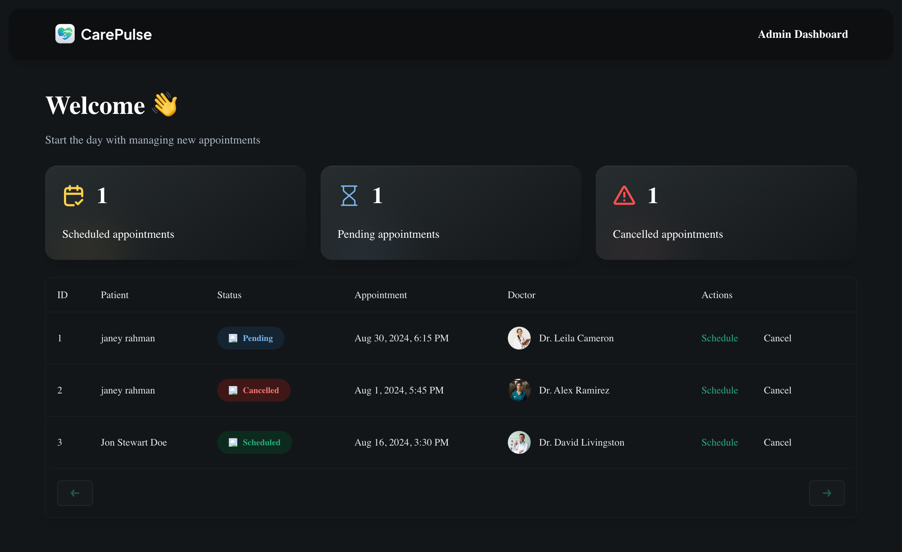

# Healthcare

This project is a sample implementation of a Health Care service application using Typescript, React, Redux, Node.js, Express, and MongoDB.

---

## Live Link

https://healthcareh.netlify.app

---

## Features

- user-friendly and visualy appealing interfaces
- home page with first appoinment, and admin 
- patient page with patient full information
- patient new-appoinment page with doctor Selection and expected appoinment date, reason for the appoinment, notes
- success page with requested appointment details and new-appointment create button
- admin page with requsted passkey, table all appointment information schedule and cancel button

---

## Technologies Used

- React
- Redux
- React router
- Typescript
- Tailwind css
- Twilio
- Shadcn
---

## Usage

1. Home Page

2. Patient Info Page

3. New Appoinment Page

4. Success Page

5. Admin Passkey

6. Admin Page

7. Twilio Sms

